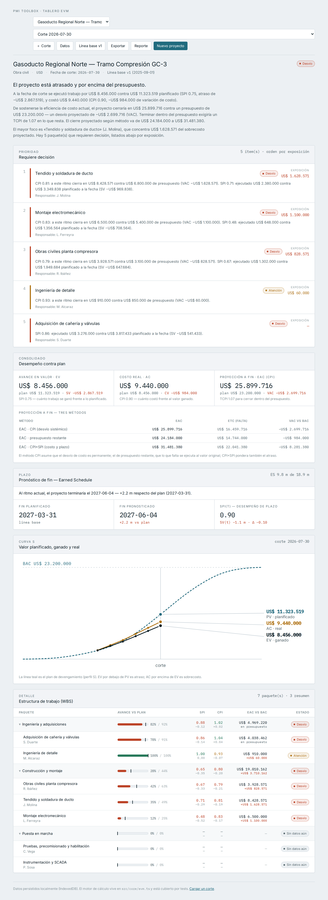
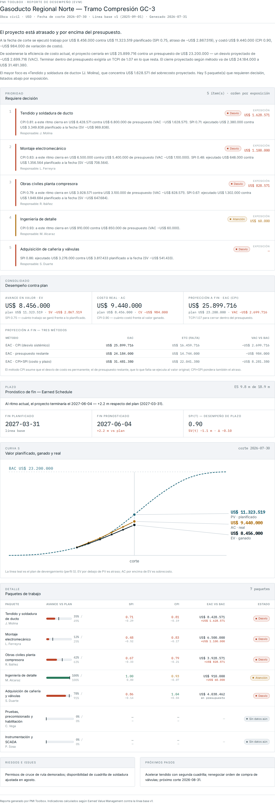
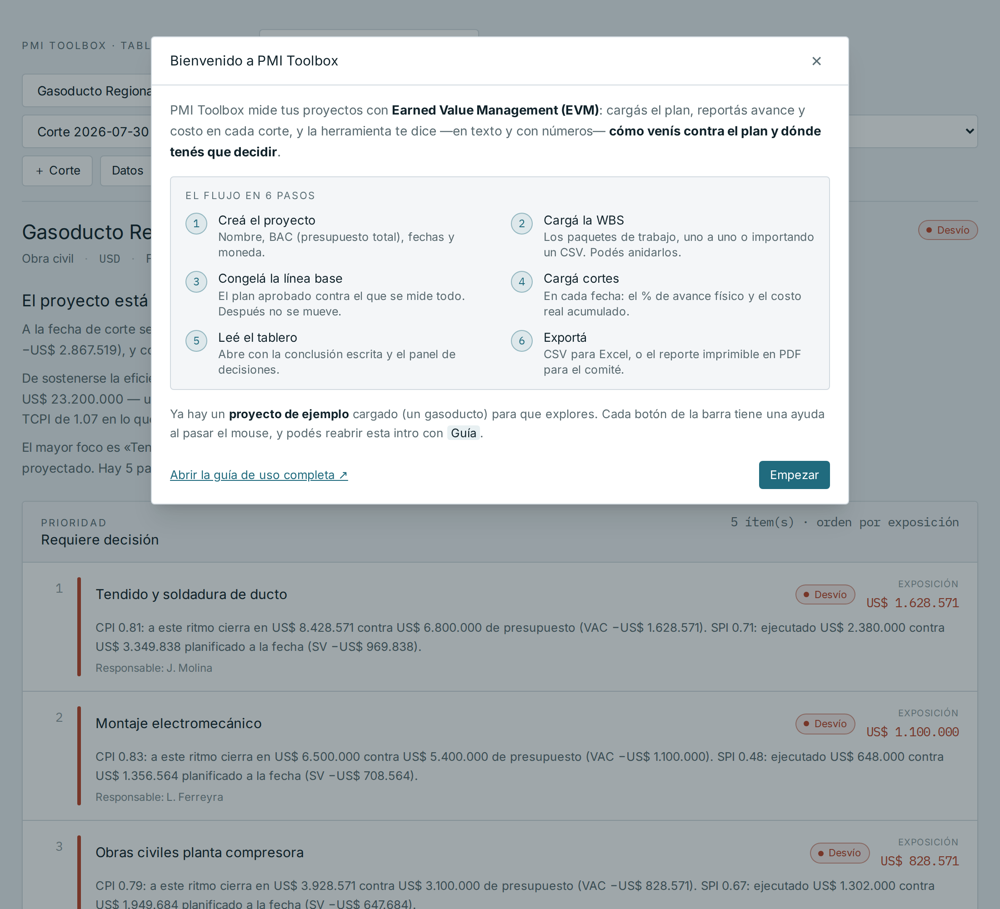
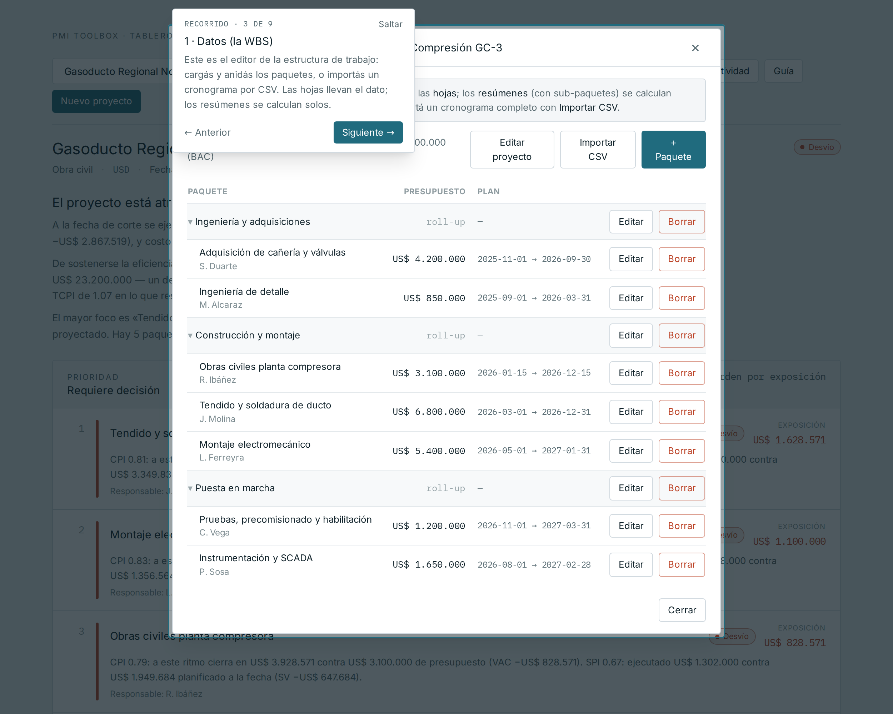
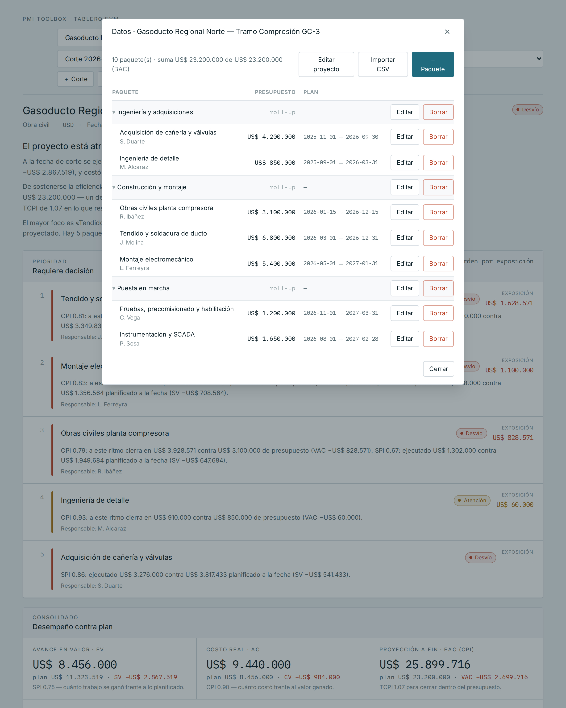
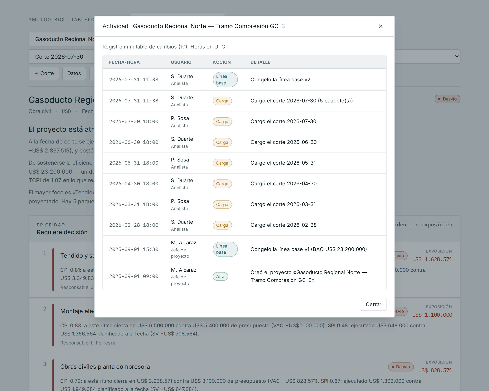

# 🎬 Capturas y videos — PMI Toolbox

Material de demo y documentación visual de la aplicación.

## Videos

- **[demo-completa.webm](demo-completa.webm)** (~44 s) — recorrido guiado que abre
  cada menú, cambio de fecha de corte, reporte y bitácora de actividad.
- **[demo-cargar-corte.webm](demo-cargar-corte.webm)** (~20 s) — cargar un corte de
  avance y ver cómo se reescriben la conclusión y todos los indicadores en tiempo real.

> Formato WebM (se reproduce en cualquier navegador moderno). Para MP4:
> `ffmpeg -i demo-completa.webm -c:v libx264 -pix_fmt yuv420p -movflags +faststart demo-completa.mp4`

## Capturas

### Tablero
El tablero abre con la conclusión escrita, el panel «Requiere decisión» (por
exposición), el consolidado, el pronóstico de plazo (Earned Schedule), la curva S
y el detalle por WBS.

### Reporte imprimible (PDF)
Documento para el comité: conclusión, decisión, consolidado, plazo, curva S,
detalle y las secciones de Riesgos y Próximos pasos.

### Intro de bienvenida
Aparece en el primer arranque; explica el flujo en 6 pasos y ofrece el recorrido guiado.

### Recorrido guiado
El tour resalta cada control en secuencia y **abre el menú** correspondiente.

### Estructura de trabajo (WBS)
Editor jerárquico: las hojas cargan el dato, los resúmenes son roll-up.

### Actividad (bitácora)
Trazabilidad: quién hizo qué y cuándo, inmutable.

